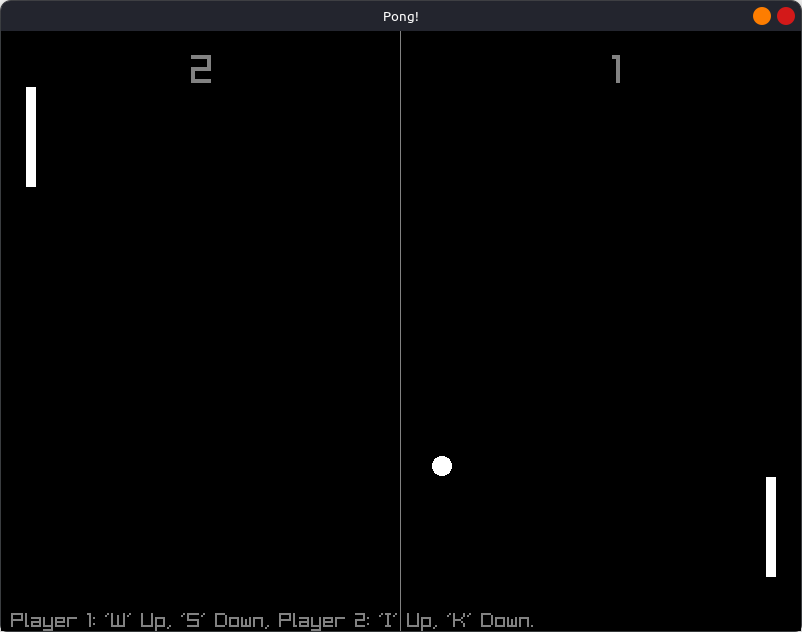

# Pong!
This is a C++ version of the classic Pong game, created with Raylib. Here is a simple illustration I've made while learning C++. I hope you had fun!
## How to play
Run the Pong.exe file to begin playing the game, and it launches right away. "W" and "S" are the controls for the first player. The controls for player two are "I" for up and "K" for down. To pause and resume the game, press "P", to quit press "Esc".
## Preview
